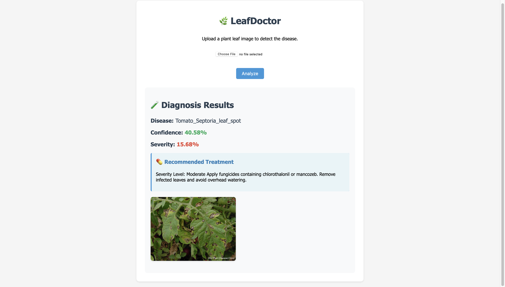
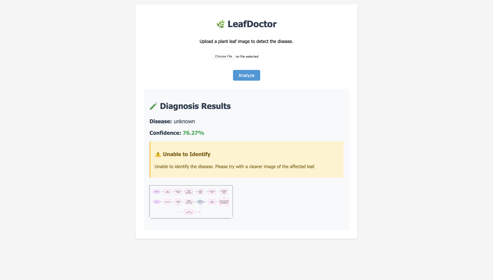
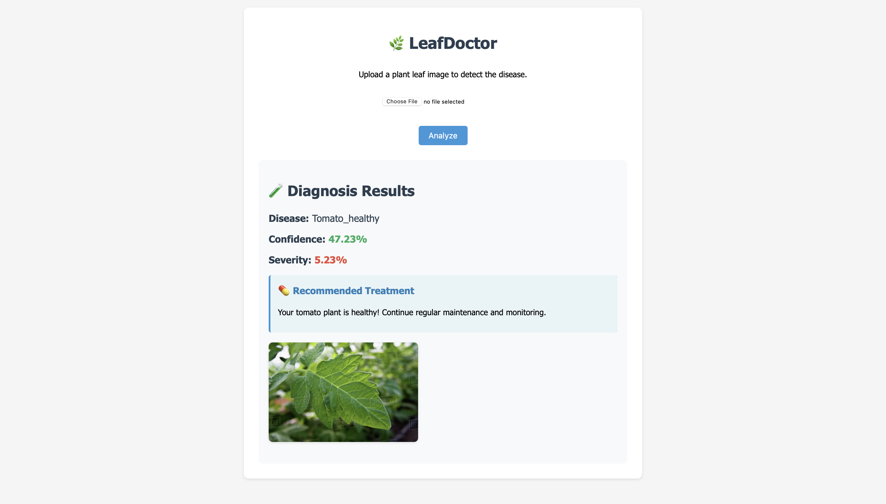
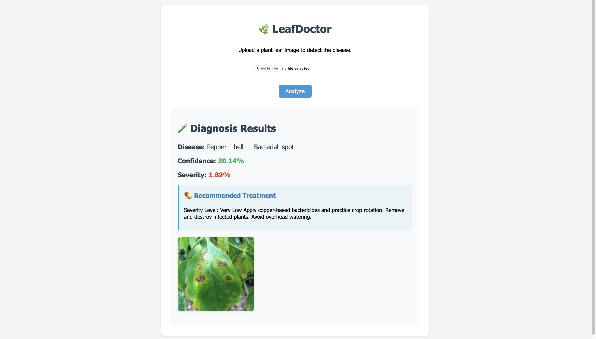

# 🌿 LeafDoctor - Plant Disease Detection System

LeafDoctor is an intelligent plant disease detection system that uses deep learning to identify diseases in plant leaves. The system can detect various diseases in plants like tomatoes, potatoes, and peppers, providing accurate diagnoses and treatment recommendations.

<span>
    
    
    
    
</span>

## 🚀 Features

- **Real-time Disease Detection**: Upload a leaf image and get instant disease identification
- **Multiple Disease Support**: Can identify 15 different plant diseases
- **Severity Analysis**: Calculates disease severity based on visual symptoms
- **Treatment Recommendations**: Provides specific treatment plans for each disease
- **User-friendly Interface**: Clean and intuitive web interface
- **Confidence Scoring**: Shows prediction confidence for each diagnosis

## 🛠️ Technologies Used

- **Backend**:
  - Python 3.x
  - Flask (Web Framework)
  - TensorFlow/Keras (Deep Learning)
  - OpenCV (Image Processing)
  - NumPy (Numerical Computing)

- **Frontend**:
  - HTML5
  - CSS3
  - JavaScript

- **Model**:
  - MobileNetV2 (Base Model)
  - Transfer Learning
  - Custom Classification Head

## 📋 Prerequisites

- Python 3.x
- pip (Python package manager)
- Virtual environment (recommended)

## 🚀 Installation

1. Clone the repository:
   ```bash
   git clone https://github.com/yourusername/leafdoctor.git
   cd leafdoctor
   ```

2. Create and activate a virtual environment:
   ```bash
   python -m venv venv
   source venv/bin/activate  # On Windows: venv\Scripts\activate
   ```

3. Install required packages:
   ```bash
   pip install -r requirements.txt
   ```

4. Download the pre-trained model:
   - Place the model file `plant_disease_model_with_unknown_class.h5` in the `model` directory

## 🏃‍♂️ Running the Application

1. Start the Flask server:
   ```bash
   python app.py
   ```

2. Open your web browser and navigate to:
   ```
   http://localhost:5000
   ```

## 📸 Usage

1. Click the "Choose File" button to select a leaf image
2. Click "Analyze" to process the image
3. View the results:
   - Disease name
   - Confidence score
   - Severity percentage
   - Recommended treatment

## 🧠 Model Training

The model is trained on the PlantVillage dataset with the following specifications:

- **Base Model**: MobileNetV2
- **Image Size**: 224x224 pixels
- **Training Process**:
  1. Initial training with frozen base model
  2. Fine-tuning of last 30 layers
- **Data Augmentation**:
  - Rotation
  - Zoom
  - Horizontal flip
  - Rescaling

## 📊 Supported Diseases

The system can detect the following diseases:

### Tomato Diseases
- Bacterial Spot
- Early Blight
- Late Blight
- Leaf Mold
- Septoria Leaf Spot
- Spider Mites
- Target Spot
- Yellow Leaf Curl Virus
- Mosaic Virus
- Healthy

### Potato Diseases
- Early Blight
- Late Blight
- Healthy

### Pepper Diseases
- Bacterial Spot
- Healthy

## 🤝 Contributing

Contributions are welcome! Please feel free to submit a Pull Request. For major changes, please open an issue first to discuss what you would like to change.

## 📝 License

This project is licensed under the MIT License - see the [LICENSE](LICENSE) file for details.

## 🙏 Acknowledgments

- PlantVillage dataset for training data
- TensorFlow team for the MobileNetV2 architecture
- OpenCV community for image processing tools

## 📧 Contact

For any queries or suggestions, please open an issue in the repository.

## 🔄 Updates

- Added severity analysis
- Improved treatment recommendations
- Enhanced UI/UX
- Added support for unknown cases

## ⚠️ Limitations

- Works best with clear, well-lit images of leaves
- May not identify very early stages of diseases
- Requires good quality images for accurate results

## 🎯 Future Improvements

- [ ] Add support for more plant species
- [ ] Implement real-time video analysis
- [ ] Add mobile app version
- [ ] Include disease prevention tips
- [ ] Add historical analysis of plant health
